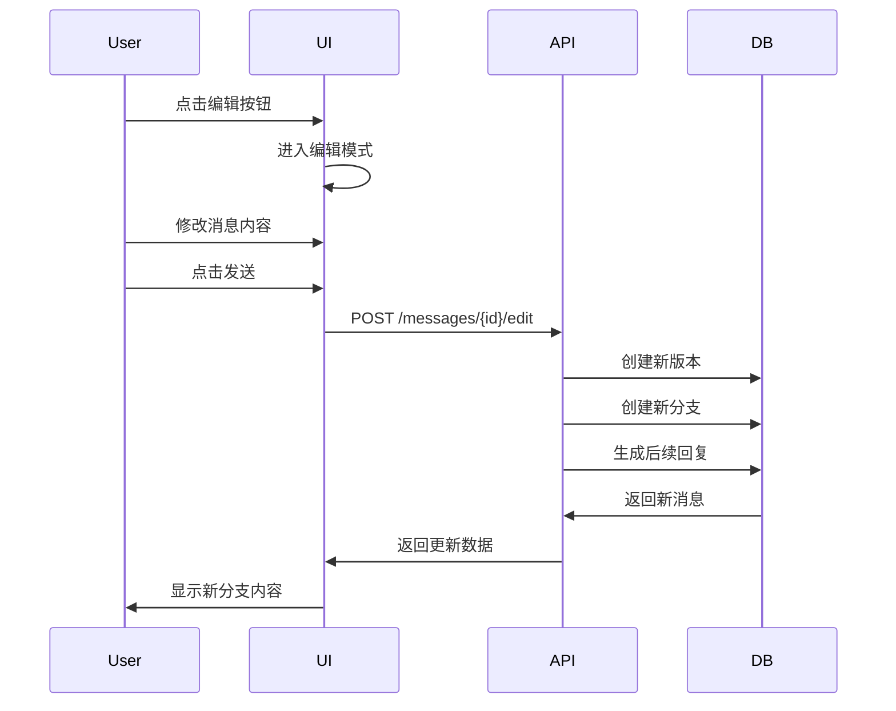

# 消息编辑和分支管理系统设计方案

## 1. 概述

### 1.1 背景
用户需要一个类似 ChatGPT 的消息编辑功能，允许在对话历史中修改消息并创建新的对话分支。这将使用户能够探索不同的对话路径，而不会丢失原始对话历史。

### 1.2 核心功能
- 编辑历史消息并重新发送
- 自动创建消息分支
- 在不同消息版本间切换
- 可视化分支导航

## 2. 系统架构

### 2.1 数据模型设计

#### 2.1.1 新增数据表

**message_branches (消息分支表)**
```sql
CREATE TABLE message_branches (
    id UUID PRIMARY KEY DEFAULT gen_random_uuid(),
    conversation_id UUID NOT NULL REFERENCES conversations(id) ON DELETE CASCADE,
    parent_message_id UUID REFERENCES chat_messages(id) ON DELETE CASCADE,
    sequence_number INTEGER NOT NULL,
    branch_name VARCHAR(100),
    created_at TIMESTAMP DEFAULT CURRENT_TIMESTAMP,
    updated_at TIMESTAMP DEFAULT CURRENT_TIMESTAMP,
    UNIQUE(conversation_id, parent_message_id, sequence_number)
);

-- 索引优化
CREATE INDEX idx_message_branches_conversation ON message_branches(conversation_id);
CREATE INDEX idx_message_branches_parent ON message_branches(parent_message_id);
```

#### 2.1.2 修改现有表结构

**chat_messages 表扩展**
```sql
-- 添加分支相关字段
ALTER TABLE chat_messages ADD COLUMN branch_id UUID REFERENCES message_branches(id) ON DELETE CASCADE;
ALTER TABLE chat_messages ADD COLUMN version_number INTEGER DEFAULT 1;
ALTER TABLE chat_messages ADD COLUMN is_current_version BOOLEAN DEFAULT true;
ALTER TABLE chat_messages ADD COLUMN parent_version_id UUID REFERENCES chat_messages(id);

-- 添加索引
CREATE INDEX idx_chat_messages_branch_version ON chat_messages(branch_id, version_number);
CREATE INDEX idx_chat_messages_parent_version ON chat_messages(parent_version_id);
```

### 2.2 数据结构示例

```json
{
  "conversation": {
    "id": "conv-123",
    "messages": [
      {
        "id": "msg-1",
        "content": "Hello",
        "role": "user",
        "branch_id": "branch-main",
        "version_number": 1,
        "versions": []
      },
      {
        "id": "msg-2", 
        "content": "Hi there!",
        "role": "assistant",
        "branch_id": "branch-main",
        "version_number": 1,
        "versions": []
      },
      {
        "id": "msg-3",
        "content": "Tell me about Python",
        "role": "user", 
        "branch_id": "branch-main",
        "version_number": 1,
        "versions": [
          {
            "id": "msg-3-v2",
            "content": "Tell me about JavaScript",
            "branch_id": "branch-alt-1",
            "version_number": 2
          }
        ]
      }
    ]
  }
}
```

## 3. API 设计

### 3.1 RESTful API 端点

#### 3.1.1 消息编辑
```
POST /api/v1/conversations/{conversation_id}/messages/{message_id}/edit
```
**请求体:**
```json
{
  "content": "修改后的消息内容",
  "create_branch": true
}
```
**响应:**
```json
{
  "message": {
    "id": "msg-123-v2",
    "content": "修改后的消息内容",
    "version_number": 2,
    "branch_id": "branch-456"
  },
  "branch": {
    "id": "branch-456",
    "name": "Alternative path 1",
    "parent_message_id": "msg-122"
  }
}
```

#### 3.1.2 获取消息版本
```
GET /api/v1/conversations/{conversation_id}/messages/{message_id}/versions
```
**响应:**
```json
{
  "versions": [
    {
      "id": "msg-123-v1",
      "version_number": 1,
      "content": "原始内容",
      "branch_id": "branch-main",
      "created_at": "2024-01-01T00:00:00Z"
    },
    {
      "id": "msg-123-v2", 
      "version_number": 2,
      "content": "修改后内容",
      "branch_id": "branch-alt",
      "created_at": "2024-01-02T00:00:00Z"
    }
  ]
}
```

#### 3.1.3 分支切换
```
POST /api/v1/conversations/{conversation_id}/branches/{branch_id}/switch
```
**响应:**
```json
{
  "branch": {
    "id": "branch-456",
    "messages": [...]
  }
}
```

#### 3.1.4 获取分支树
```
GET /api/v1/conversations/{conversation_id}/branch-tree
```
**响应:**
```json
{
  "branches": [
    {
      "id": "branch-main",
      "name": "Main",
      "parent_message_id": null,
      "children": [
        {
          "id": "branch-alt-1",
          "name": "Alternative 1",
          "parent_message_id": "msg-3"
        }
      ]
    }
  ]
}
```

## 4. 前端 UI/UX 设计

### 4.1 消息编辑界面

#### 4.1.1 编辑模式
- 每条用户消息右侧显示编辑按钮（铅笔图标）
- 点击后消息内容变为可编辑文本框
- 显示"发送新版本"和"取消"按钮

#### 4.1.2 版本指示器
- 在有多个版本的消息上显示版本切换控件
- 格式: `< 1/3 >` (当前版本/总版本数)
- 左右箭头用于切换版本

### 4.2 分支可视化

#### 4.2.1 分支标识
- 当前所在分支路径显示在对话顶部
- 格式: `Main > Alternative 1 > Sub-branch 2`

#### 4.2.2 分支切换器
- 下拉菜单显示所有可用分支
- 树形结构展示分支关系
- 高亮显示当前分支

### 4.3 交互流程



## 5. 实现计划

### 5.1 第一阶段：基础功能（1-2周）
- [ ] 数据库表结构设计与迁移
- [ ] 后端 API 基础实现
- [ ] 前端编辑功能
- [ ] 版本切换基础功能

### 5.2 第二阶段：分支管理（1-2周）
- [ ] 分支创建与切换
- [ ] 分支可视化
- [ ] 分支删除与合并

### 5.3 第三阶段：优化与完善（1周）
- [ ] 性能优化
- [ ] UI/UX 改进
- [ ] 测试与修复

## 6. 技术挑战与解决方案

### 6.1 挑战
1. **复杂的树状数据结构管理**
   - 解决方案：使用递归 CTE 查询优化性能

2. **分支切换时的状态同步**
   - 解决方案：前端维护分支状态缓存

3. **大量分支时的性能问题**
   - 解决方案：懒加载和分页

### 6.2 性能优化
- 使用数据库索引优化查询
- 前端缓存已加载的分支数据
- 限制分支深度（建议最多 10 层）

## 7. 安全考虑

### 7.1 权限控制
- 用户只能编辑自己的消息
- 分支数量限制（防止恶意创建）
- API 请求频率限制

### 7.2 数据完整性
- 使用数据库事务保证一致性
- 软删除机制保护数据
- 定期备份分支数据

## 8. 未来扩展

### 8.1 潜在功能
- 分支对比功能
- 分支合并功能
- 分支导出/分享
- 协作编辑

### 8.2 集成可能
- 与版本控制系统集成
- AI 辅助分支建议
- 分支质量评分